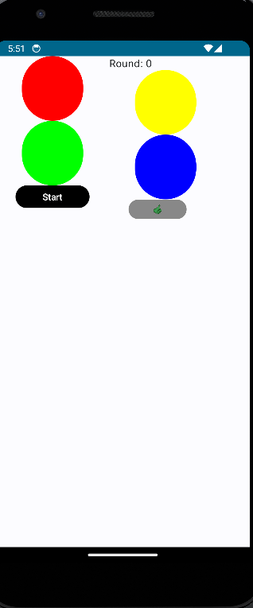

# Simon Dice MVVC

Simon Dice MVVC es una aplicación que implementa el clásico juego "Simon Dice" utilizando el patrón de arquitectura MVVC (Modelo-Vista-VistaModelo-Clase de Interfaz de Usuario). El juego consiste en que el dispositivo muestra una secuencia de colores al jugador, quien luego debe repetir la secuencia correctamente.

## Características Principales

- **Arquitectura MVVC**: El juego sigue el patrón de arquitectura Modelo-Vista-VistaModelo-Clase de Interfaz de Usuario para una organización clara y separación de responsabilidades.

- **Gestión del Estado del Juego**: El ViewModel (`MyViewModel`) maneja el estado del juego, incluyendo el inicio, reinicio, progreso de rondas, registro de puntuaciones más altas y verificación de secuencias.

- **Secuencia de Colores**: El ViewModel genera y gestiona secuencias de colores tanto para la máquina como para el usuario, asegurando que se muestren y almacenen correctamente.

- **Interfaz de Usuario Gráfica**: Utiliza Jetpack Compose para construir una interfaz de usuario gráfica intuitiva y atractiva, con botones de colores y elementos visuales que representan el juego.

- **Manipulación de Colores**: Proporciona funciones para manipular colores, como oscurecer un color y hacer que el color del usuario parpadee en blanco.

- **Registro de Puntuaciones Altas**: Registra la puntuación más alta alcanzada por el jugador durante la sesión de juego.

## Cómo Utilizar

1. **Iniciar Juego**: Presiona el botón "Start" para iniciar el juego. La máquina mostrará una secuencia de colores.

2. **Repetir Secuencia**: Repite la secuencia mostrada por la máquina presionando los botones de colores correspondientes.

3. **Verificar Secuencia**: Una vez que hayas repetido la secuencia, presiona el botón de "Send" para verificar tu secuencia.

4. **Continuar Jugando**: El juego continuará mostrando secuencias cada vez más largas. Intenta superar tu puntuación más alta.

